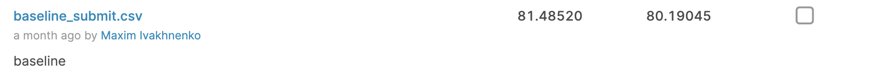
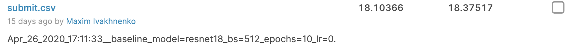
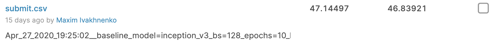
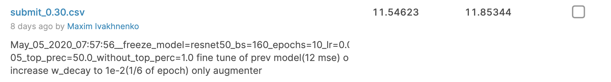
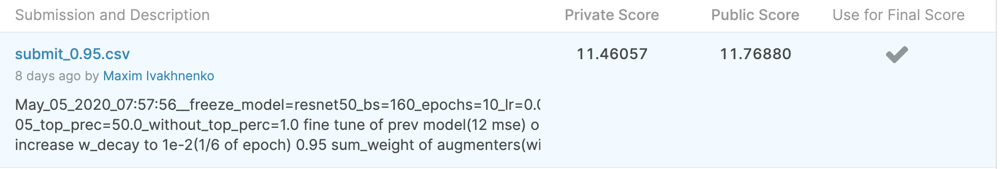

```python hack_train.py --name "baseline" --data "PATH_TO_DATA" [--gpu]```

# Что было сделано

## Бейзлайн
1) Перенес весь код обучения в ноутбук `train_model.ipynb`
2) Обучил бейзлайн


## Настроил нормальный пайплайн для работы
1) Исправил заметные ухудшения:
    - поменял константы нормализации на нормальные для image net
    - поменял crop_size
    - поменял optimizer на AdamW
2) Добавил логирование метрик для train/val в tensorboard
    ```bash
    tensorboard --logdir=log_dir_serv
    ```
3) Обучил resnet18 на 1 эпоху `Apr_26_2020_17:11:33__baseline_model=resnet18_bs=512_epochs=10_lr=0.01_lr_decay=0.7_w_decay=0.01`

    P.S. Число эпох в названии почти всегда = 10, но на деле не больше 4 

4) Добавил логирование картинок с наихудшими предсказаниями для train/val в tensorboard

#### Попробовал Inception_v3
На одну эпоху. Не очень.


## Аугментация
1) Адаптировал к текущему датасету:
    - AffineAugmenter
    - CropAugmenter
    - BrightnessContrastAugmenter
    - BlurAugmenter
    - Augmenter(ничего не делает)
2) Добавил RandomAugmenter с вероятностями для каждой аугментации 
3) Добавил возможность возращать изображение и точки к состоянию до аугментации(насколько это возможно)


## Тюнинг аугментации
1) просмотрел глазами пару тысяч фоток, чтобы понять, какие преобразования полезны. 
Получилось, что часто встречаются:
    - черные полосы сверху/снизу(не обязательно одинакового размера, а иногда могут и по бокам)
    - яркость/контрастность(есть сильно светлые фото, есть седая бабушка на светлом фоне, есть черные на черном еще и вся фотка темная)
    - повороты, отзеркаливания(одной стороной лица), сдвиги
    - растяжение/сжатие
    - чернобелая
    - надписи на лицах
    - вид сбоку
2) Подобрал вручную параметры для разных аугментеров так, 
чтобы при любом преобразовании получалось изображение, 
которое может встретиться в test'е.
3) Часточность аугментеров подбирал по ощущению "полезности" данной аугментации

## Backbone
По бенчмаркам(https://www.sotabench.com/benchmarks/image-classification-on-imagenet) выбрал оптимальный 
backbone из pytorch реализаций по соотношению `TOP 1 ACCURACY / SPEED` - это `ResNet50`.

## Тюнинг Learning Rate
1) Запустил обучение с lr убывающим c 1e-2 до 1e-5. 
2) По графику сглаженного train_loss'а по батчам подобрал lr из соображений, что:
    - `lr in [1e-3, 1e-2]`: довольно радикальный, но позволяет быстро сделать веса такими, что модель начинает давать ответы хотя бы по смыслу похожие. Т.е. быстрая грубая настройка случайных весов(предобученные веса скорее такой lr испортит)
    - `lr in [1e-4, 1e-3]`: нормально обучает модель со средней скоростю. Подходит для уже ± адекватных весов. Рандомные веса медленно получается прообучить с таким lr
    - `lr in [3e-5, 1e-4]`: подходит для конечной подкрутки качества модели
3) Выбрал ReduceLROnPlateau 
    - c начальным `lr = 1e-2`, если обучение с случайными весами и `lr in [1e-4, 1e-3]`, если дообучал
    - `factor` брал `[0.7, 0.85]`
    - `patience` от `25%` до `10%` от количества батчей в эпохе

## Loss
Чтобы не портить модель выбросами, заменил MSE на SmoothedL1.

## Ансамблирование для бедных
1) Добавил возможность фиксировать параметры, с которыми работают аугментеры. 
2) Далее использовал это для предсказания test'а:
    - предсказываю с фиксированым преобразованием
    - выполняю обратное преобразование для предсказаний
    - усредняю результаты с задаными весами


## Train set
В какой-то момент добавил в обучение 95% данных(так и оставил до конца).

#### Попробовал ResNet50 с этими изменениями
.png)

## "Active learning"
Обучался на примерах, loss которых лежит в диапазоне `[without_top_perc_train, top_perc_train]`.
Например, диапазон `[1%, 30%]`, тогда в лосс батча не попадет `1%` примеров с наибольшим лоссом и `70%` с наименьшим.
Таким образом пытался отбросить выбросы, но обучаться на сложных примерах. 

Не понял, помогло ли это хоть как-то(пробовал много раз запускать с разными параметрами не дольше 1 эпохи), 
но идея мне очень понравилась. 

### Пробовал
Замораживать backbone, но тогда очень плохо сходится

## Убрал weight_decay - это было зря
Подумал, что SmoothedL1 + Active learning = нормальная регуляризация 
и можно убрать штраф на веса(был `weight_decay=1e-2`).
Но в результате получил переобучение с огромными весами.

### Попробовал ResNet50 обучать подольше
Заморозил backbone на первую эпоху(чтобы FC слой подобрал адекватные веса).
Потом еще 3 эпохи с меньшим lr и размороженной моделью.
Ощущение, что первая эпоха прошла бесполезно.
_and_unfreeze(3)_model=resnet50_epochs=4.png)

### Попробовал дообучил предыдущую модель
Уже оставалось 3 часа на сервере.
Нашел статью про ENMELoss(не могу найти ссылку).
Дообучил на 1 эпоху с маленьким lr предыдущую модель(вернул `weight_decay=1e-5`).
Потом еще на 0.5 эпохи с `weight_decay=1e-2`(`weight_decay=1e-5` почти не уменьшил веса).

Две отправки с разными ансамблированиями ответов:

